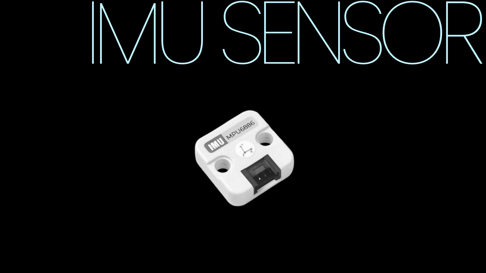
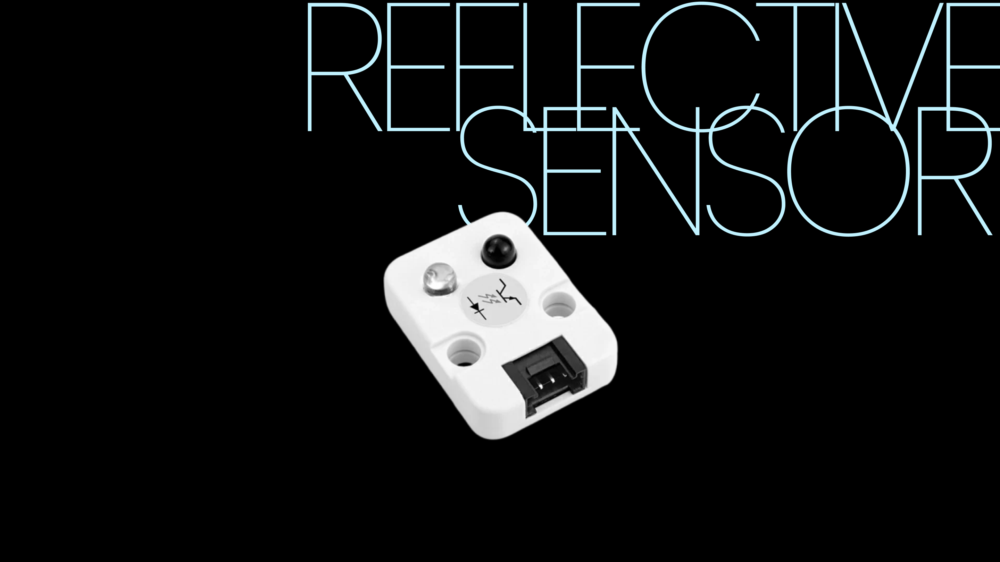
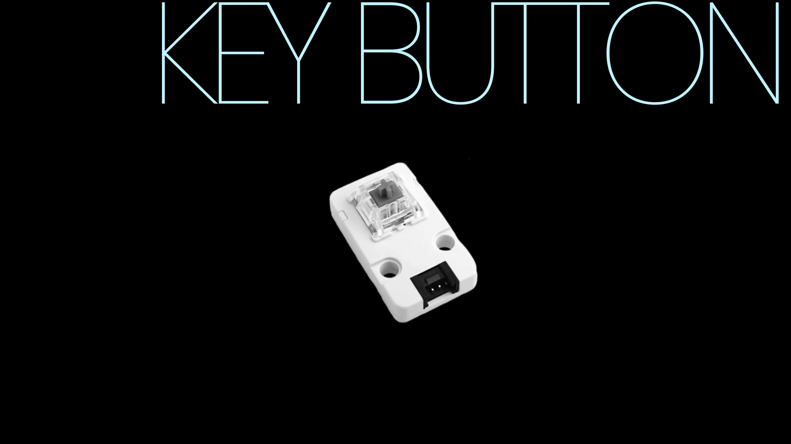
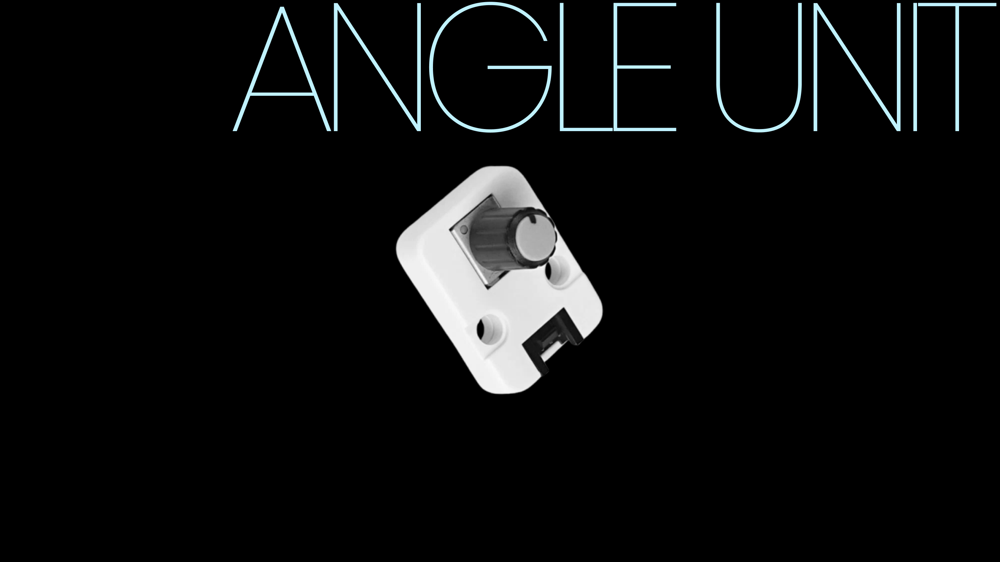

# NIUCOZ

Software using **Thonny** & **Touch Designer**

## 1. Concept
Using “button (coz)” as a medium to represent a moment in time.

In this case will be the **MORNING**.

## 2. Auditory
As I thinking about the Morning, which will be the time period that I most likely not being awake, it will always reminds me of these four audios:

**1. Bicycle**
[Play](mov/bicycle.mov)

**2. Bird Sound**
[Play](mov/birdsong.mov)

**3. Alarm**
[Play](mov/alarm.mov)

**4. Sweeping**
[Play](mov/sweep.mov)

## 3. Visual
I overlayed 3 videos on Touch Designer. 
The default one I was trying to find some animation that is constant and infinite.

Plus the other 2 videos I pulled out from my photobooth, to made a overlay with the default video.

And here is the result when I finished wraping them.

## 4. Hardware

