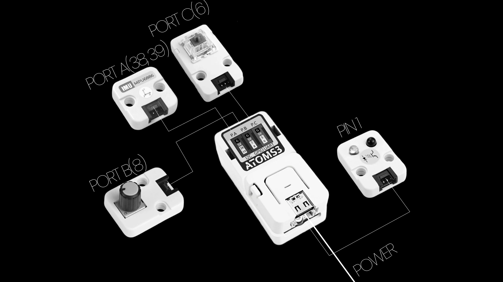
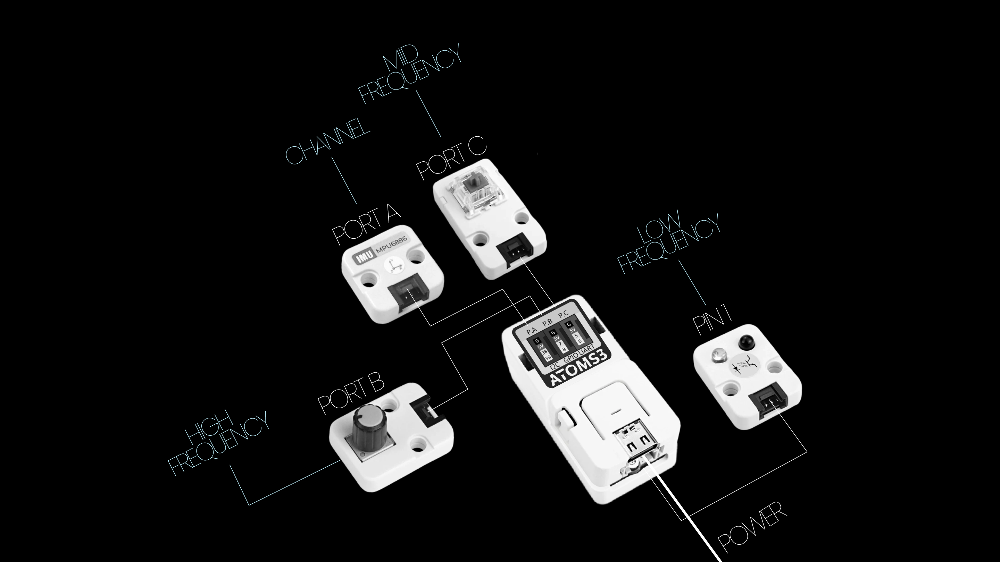
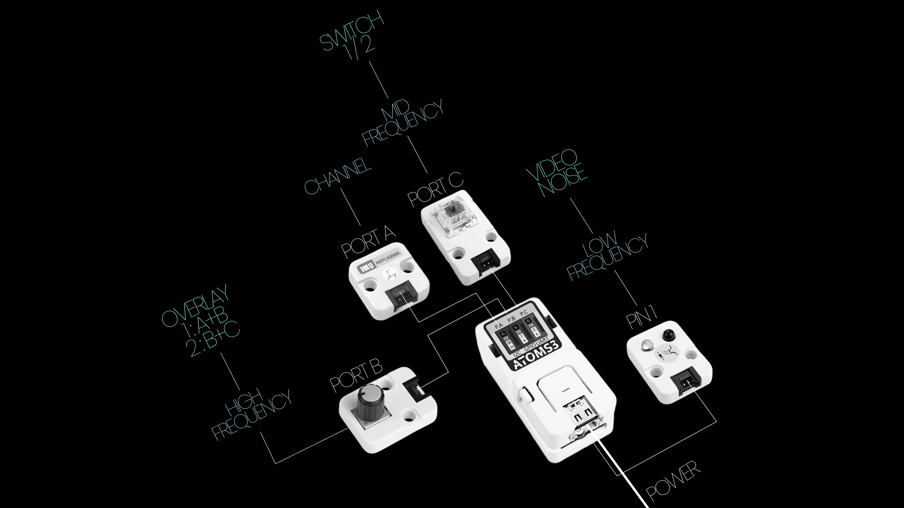
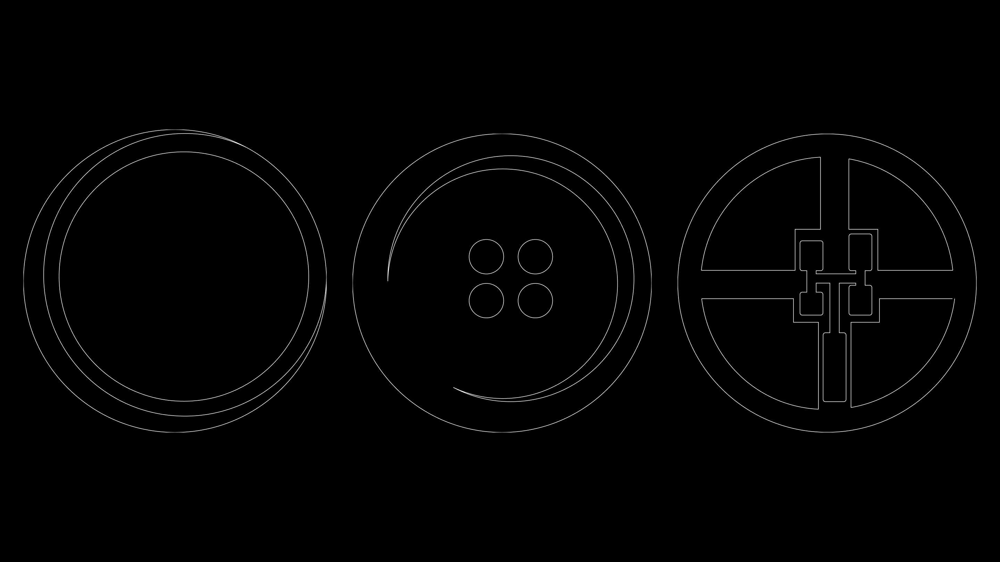
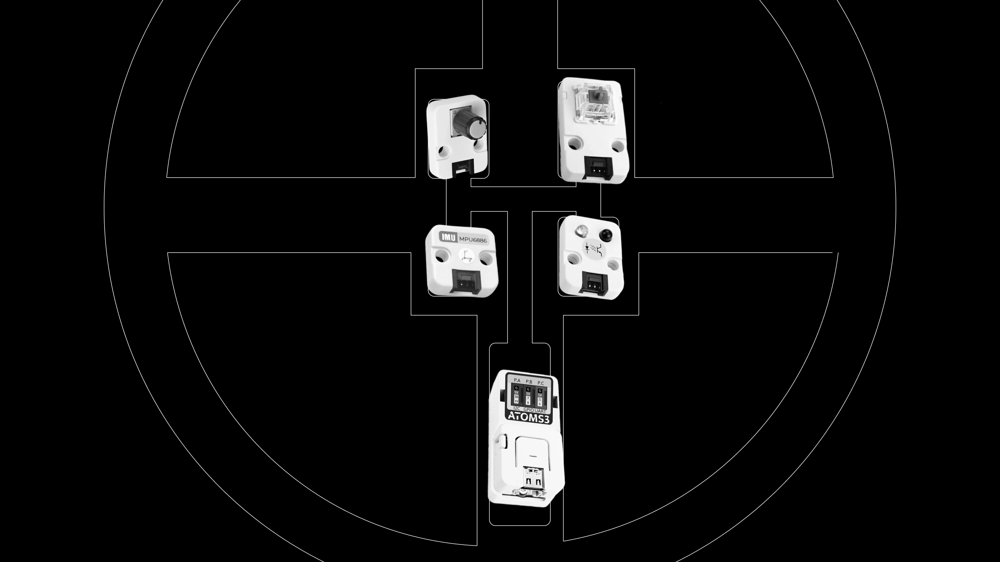

# NIUCOZ

Software using **Thonny** & **Touch Designer**

## 1. Concept
Using “button (coz)” as a medium to represent a moment in time.

In this case will be the **MORNING**.

## 2. Auditory
As I thinking about the Morning, which will be the time period that I most likely not being awake, it will always reminds me of these four audios:

**1. Bicycle**

https://github.com/user-attachments/assets/e68398bf-a4ed-477d-b64c-77a81623e03d

**2. Bird Sound**

https://github.com/user-attachments/assets/ddc4b0df-5207-42d8-9862-eb31254770a0

**3. Alarm**

https://github.com/user-attachments/assets/5abd9412-6790-4911-941d-25817dcb7116

**4. Sweeping**

https://github.com/user-attachments/assets/c9755c53-1f31-4c61-b721-c6e4659cc10f

## 3. Visual
I overlayed 3 videos on Touch Designer. 
The default one I was trying to find some animation that is constant and infinite.

https://github.com/user-attachments/assets/f7cb9640-1ff6-42a5-92a1-afb053322bb4

Plus the other 2 videos I pulled out from my photobooth, to made a overlay with the default video.

And here is the result when I finished wraping them.

https://github.com/user-attachments/assets/0d8b0cc9-c3a9-470d-b85b-267d8bc6e5ac

## 4. Hardware

## 5. Final Video

https://github.com/user-attachments/assets/a8b296e6-515f-4426-b4b0-63198d3afd3d

