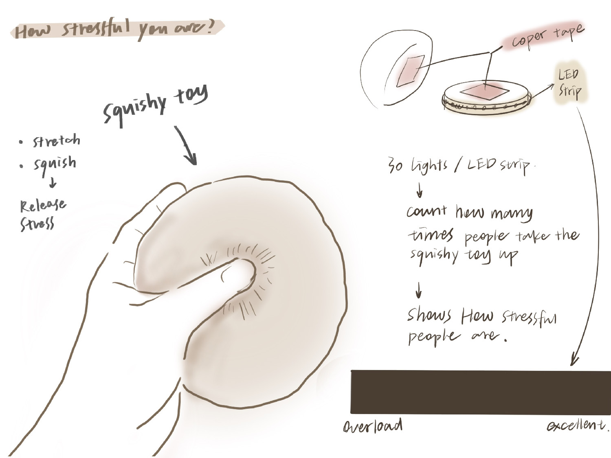

# Project 1 Stress Detect Bun  
Code snipped for changing states in the program:  
[Project1 Code link](stresscount.py)

```Python
def emergency_red_flash():
    for _ in range(5):  
        for i in range(30):
            set_led_color(i, 255, 0, 0)  
        time.sleep(0.5)  
        rgb2.fill_color(0x000000)  
        time.sleep(0.5)  
    rgb2.fill_color(0x000000)
```
Image link example:

