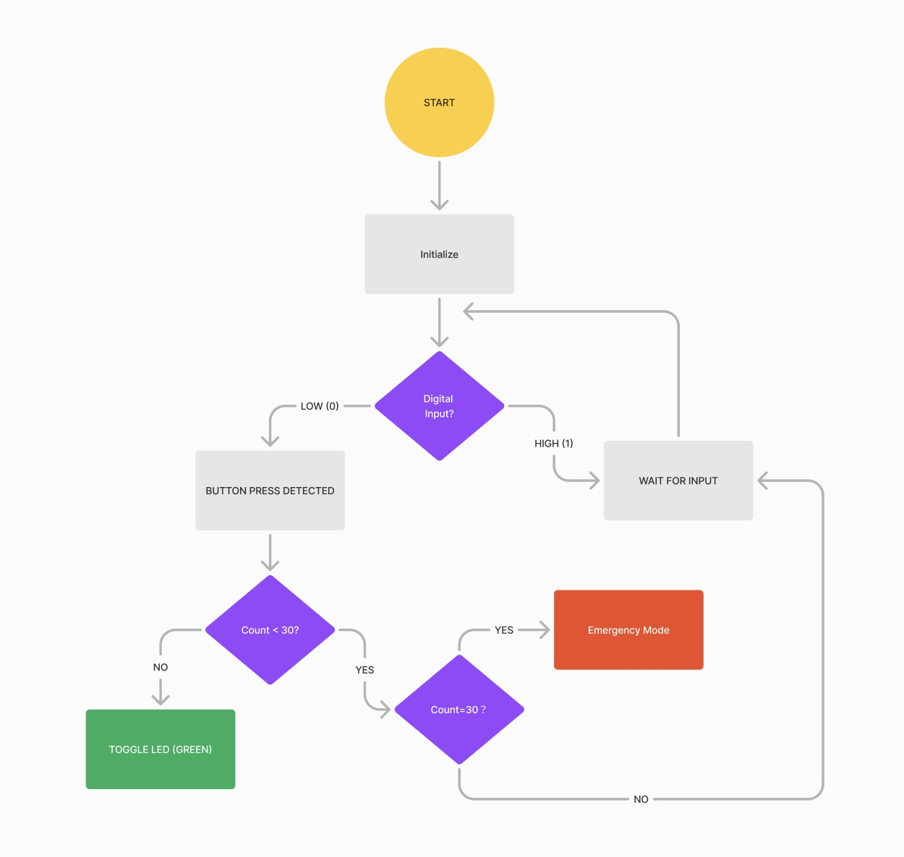
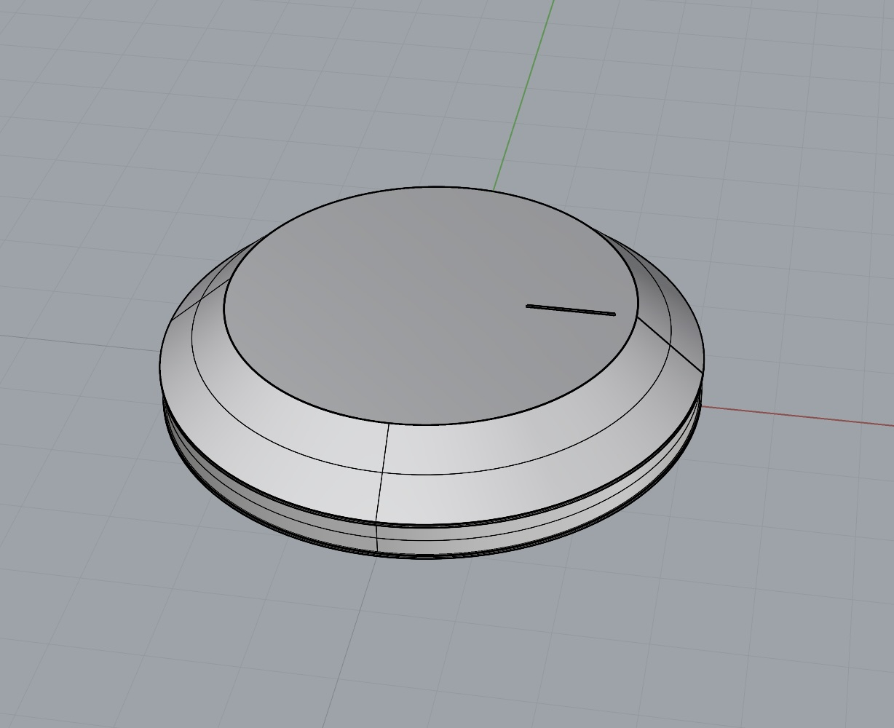
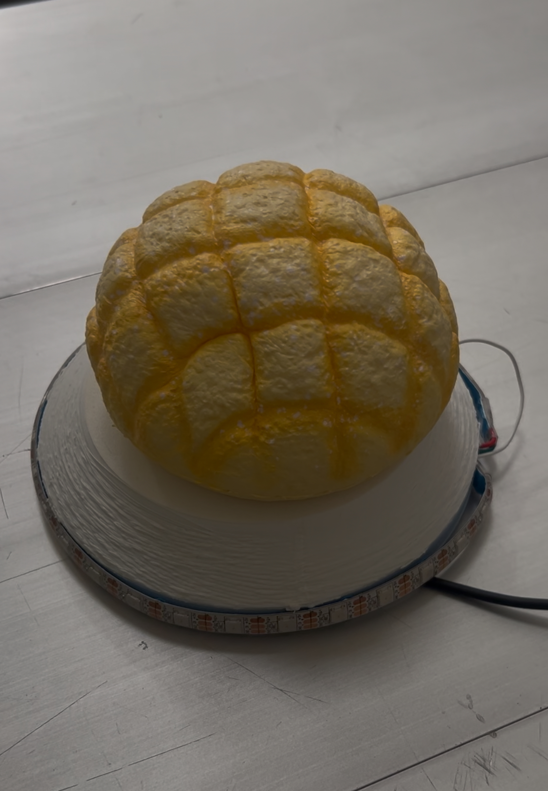

# Project 1 Stress Detect Bun  
## Introduction
This is a stress detection installation. As students, we often experience stress, and recently, squishy toys have become incredibly popular for their stress-relieving properties. This project aims to use the M5 stack as a tool to measure people’s stress levels.
Image link example:


## State Diagram
The process begins by checking for input. If input is detected and the count is less than 30, one light on the LED strip will illuminate green. When the input count reaches 30, it triggers a stress emergency status, causing the LED strip to display a red blinking animation. Finally, if the count exceeds 30, it will reset the count and start the process over.


## Hardware
- M5 S3 Lite
- LED Strip

## Firmware

[Project1 Code link](stresscount.py)

```Python
def emergency_red_flash():
    for _ in range(5):  
        for i in range(30):
            set_led_color(i, 255, 0, 0)  
        time.sleep(0.5)  
        rgb2.fill_color(0x000000)  
        time.sleep(0.5)  
    rgb2.fill_color(0x000000)
```

## Physical Components
- 3d print base
- Squishy


## Project outcome

[Watch the video](./video.mp4)
